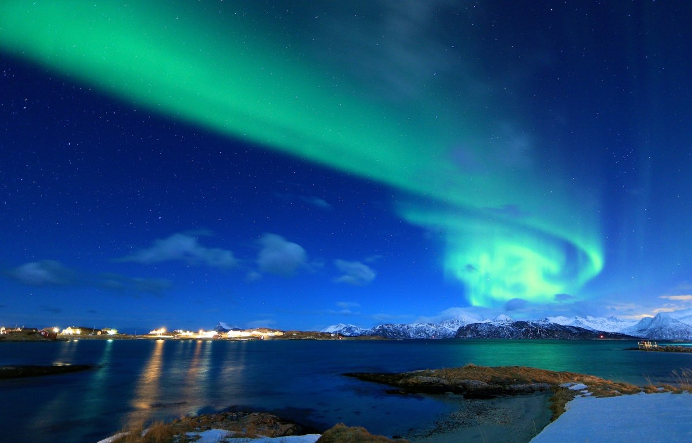

## Geospatial for a Better World
Green Light Geospatial supports teams with GIS and geospatial tech, data and projects. Our goal is helping organizations achieve the potential and benefits of GIS and geospatial technology, and working for a better world.

We have extensive experience helping organizations navigate geospatial challenges. Together we can help you chart a course based on your needs and requirements.

For information about our services and experience, please see the information on [our homepage](https://greenlightgeo.github.io).  For inquiries about our services for your project, please visit our [page on LinkedIn](https://www.linkedin.com/company/green-light-geospatial) and send a message.

While you’re here, please explore our interactive web maps which showcase open data, tools and platforms. 
The [Global Energy and Renewables Map](https://greenlightgeo.github.io/energy-map) allows you to explore global power plants and U.S. solar and wind energy projects using text search and map visualization tools. 
Also, the [UNESCO World Heritage Tribute Map](https://greenlightgeo.github.io/unesco-map) allows you to explore interesting World Heritage sites and the important work of UNESCO.

Thank you for visiting GreenLightGEO.

