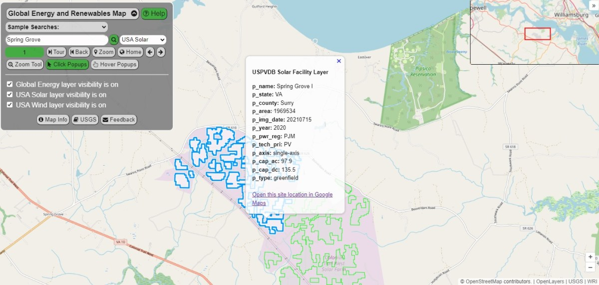

# Global Energy and Renewables Map

The Global Energy and Renewables Map is an interactive web map launched in December 2023 to help promote awareness of some important traditional and renewable energy database resources.

The map combines three open energy datasets and allows visitors to explore global power plants and U.S. solar and wind energy projects using text search and map visualization tools. It serves as both a traditional thermal energy plant map and a renewable energy map.

## The Purpose of the Global Energy and Renewables Map
Understanding the distribution and location of existing thermal and renewable energy facilities is just one small, but important step towards advancing the green transition to renewables. The Global Energy and Renewables Map includes data layers from three open databases that are available to help organizations in this work:

*  The **Global Power Plant Database** from the World Resources Institute (WRI), which includes information on thermal and renewable energy power plant facilities.
*  The **U.S. Large-Scale Solar Photovoltaic Database (USPVDB)** from the U.S. Geological Survey (USGS) and the Lawrence Berkeley National Laboratory (LBNL).
*  The **U.S. Wind Turbine Database (USWTDB)**, which is also maintained by the USGS and LBNL.

The map combines the spatial features of these three databases on a single map, and provides an easy way to view and discover facilities. Users can perform a global search on each database layer, compare the datasets and explore the locations. You can learn more about each of these databases further below.

The [Global Energy and Renewables Map](https://greenlightgeo.github.io/ol-maps/maps/global_energy/) was built using the OpenLayers map library, and uses OpenStreetMap as its basemap foundation. Click the image of the map below to open the map.

*The map displaying results of a sample search on the USPVDB layer. Click the image to open the map.*

As you get started using the map, check the Help document (press the green “Help” button) to see the map legend and look up each individual layer’s popup attributes. There’s also a quick description of each of the map tools available on the tool panel.  The tool panel provides a “Sample Searches” picklist with a few searches to help you get started and see some results on each layer. When multiple features are selected, the map will zoom to their extent, and then you can press the ‘Tour’ button to zoom in to each selected facility individually. You can then view the feature’s popup information and also click the provided link to view the location in Google Maps satellite view.

## Learning more about the Global Energy and Renewable Energy Map Databases
This section provides a brief introduction to the three energy databases used in the Global Energy and Renewables map. It includes some key excerpts of information provided on the website of each database.

Having each of the three databases combined together in a single map can provide new insights and ideas for analysis.  With this said, each of the databases do provide their own dedicated map viewer which offer excellent capabilities for exploration of each dataset. Links are provided to each viewer in the sections below.

### Global Power Plant Database
The [Global Power Plant Database](https://datasets.wri.org/dataset/globalpowerplantdatabase) from the [World Resources Institute (WRI)](https://www.wri.org/) includes features for thermal and renewable energy power plants around the world:

“The Global Power Plant Database is a comprehensive, open source database of power plants around the world. It centralizes power plant data to make it easier to navigate, compare and draw insights for one’s own analysis.”

“The methodology for the dataset creation is given in the World Resources Institute publication [‘A Global Database of Power Plants’](https://www.wri.org/research/global-database-power-plants).”

The WRI online viewer for this database is available [here on Resource Watch](https://resourcewatch.org/data/explore/Powerwatch).

### U.S. Large-Scale Solar Photovoltaic Database (USPVDB)
The [U.S. Large-Scale Solar Photovoltaic Database (USPVDB)](https://eerscmap.usgs.gov/uspvdb/), provided by the U.S. Geological Survey (USGS) and Lawrence Berkeley National Laboratory (LBNL), is a new database which was [released in November 2023](https://emp.lbl.gov/news/us-large-scale-solar-photovoltaics-database):

“The United States Large-Scale Solar Photovoltaic Database (USPVDB) provides the locations and array boundaries of U.S. ground-mounted photovoltaic (PV) facilities with capacity of 1 megawatt or more. It includes corresponding PV facility information, including panel type, site type, and initial year of operation.”

“The data may be used by government agencies, scientists, private companies, and other stakeholders for a variety of analyses. Examples include operational impact analyses related to the role of solar energy in the U.S. electric grid, interactions between PV facilities and the natural environment, and investments in PV infrastructure.”

“The database combines datasets from the U.S. EIA, the Environmental Protection Agency (EPA) and the National Renewable Energy Laboratory (NREL). The locations and array boundaries of all facilities were visually verified and digitized to within 10 meters using high-resolution aerial imagery.”

“The [USPVDB Viewer](https://eerscmap.usgs.gov/uspvdb/viewer/), created by the [USGS Energy Resources Program](https://www.usgs.gov/energy-and-minerals/energy-resources-program), allows users to visualize, inspect, interact, and download the most current USPVDB through a dynamic web application.”

Map services and data are available from Large-Scale Solar Photovoltaic Database, provided by the U.S. Geological Survey and Lawrence Berkeley National Laboratory via [https://eerscmap.usgs.gov/uspvdb](https://eerscmap.usgs.gov/uspvdb).

### U.S. Wind Turbine Database (USWTDB)
The [U.S. Wind Turbine Database (USWTDB)](https://eerscmap.usgs.gov/uswtdb/), also provided by the U.S. Geological Survey (USGS) and Lawrence Berkeley National Laboratory (LBNL), has been available since 2018:

“The United States Wind Turbine Database (USWTDB) provides the locations of land-based and offshore wind turbines in the United States, corresponding wind project information, and turbine technical specifications.”

“These data are used by government agencies, scientists, private companies, and citizens for a variety of analyses. Examples include operational impact assessments of turbines on air defense radar, weather and general aviation, analyses related to the role of wind energy in the U.S. electric grid, interactions between wind energy facilities and wildlife, and investments in wind energy infrastructure.”

“The locations of all turbines were visually verified to within 10 meters using high-resolution imagery. Technical specifications of the turbines are based on the make and model and other information collected.”

“The [USWTDB Viewer](https://eerscmap.usgs.gov/uswtdb/viewer/), created by the [USGS Energy Resources Program](https://www.usgs.gov/energy-and-minerals/energy-resources-program), lets you visualize, inspect, interact, and download the most current USWTDB through a dynamic web application.”

Map services and data are available from U.S. Wind Turbine Database, provided by the U.S. Geological Survey, American Clean Power Association, and Lawrence Berkeley National Laboratory via [https://eerscmap.usgs.gov/uswtdb](https://eerscmap.usgs.gov/uswtdb).

### Brief map demonstration
<iframe src="https://www.youtube.com/embed/fnDh88Zqhu4?si=-BCcHuDV27hcYCCa" title="YouTube video player" frameborder="0" allow="accelerometer; autoplay; clipboard-write; encrypted-media; gyroscope; picture-in-picture; web-share" referrerpolicy="strict-origin-when-cross-origin" style="width:100%;aspect-ratio:16/9;max-width:100%;border:none;display:block;" allowfullscreen></iframe>

### Special Thanks
Special thanks to the following organizations for making this map possible:

* The **U.S. Geological Survey (USGS)** and **Lawrence Berkeley National Laboratory (LBNL)** and partners for sharing open data on the U.S. Solar (USPVDB) and U.S. Wind (USWTDB) database projects.
* **World Resources Institute (WRI)** and partners for sharing open data on the Global Power Plant Database.
* **OpenStreetMap** and its contributors for sharing their important work and open basemap.
* **OpenLayers** and its contributors for their free and open source map library on which this map was built.

*Wind turbines photo by Lukas Bieri.*
