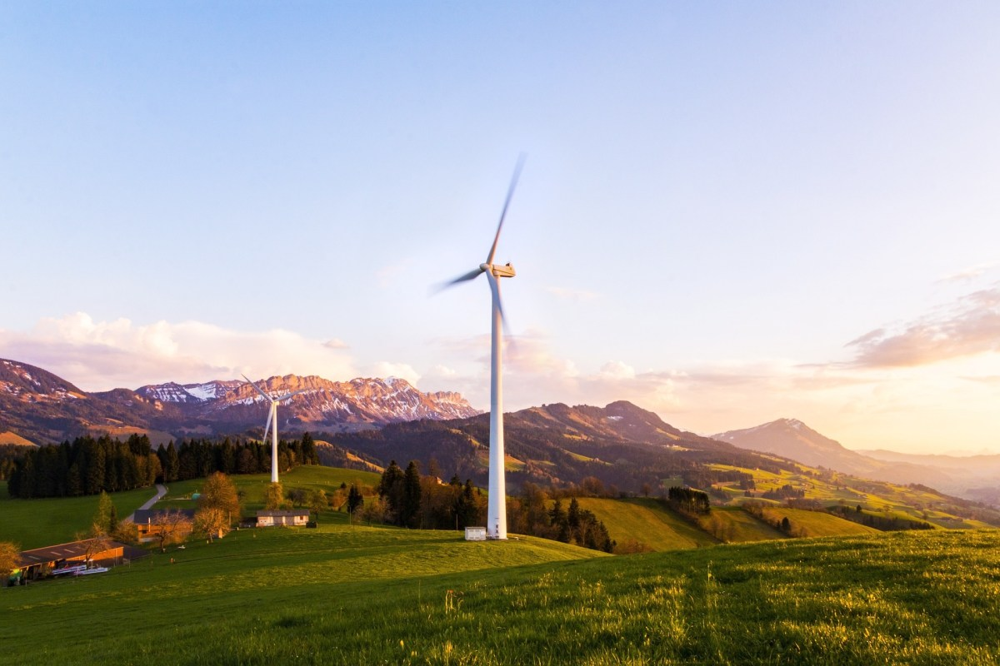

# Global Energy and Renewables Map

The Global Energy and Renewables Map is an interactive web map launched in December 2023 to help promote awareness of some important traditional and renewable energy database resources.

The map combines three open energy datasets and allows visitors to explore global power plants and U.S. solar and wind energy projects using text search and map visualization tools.

## The Purpose of the Global Energy and Renewables Map
Understanding the distribution and location of existing thermal and renewable energy facilities is just one small, but important step towards advancing the green transition to renewables. The Global Energy and Renewables Map includes data layers from three open databases that are available to help organizations in this work:

*  The **Global Power Plant Database** from the World Resources Institute (WRI), which includes information on thermal and renewable energy power plant facilities.
*  The **U.S. Large-Scale Solar Photovoltaic Database (USPVDB)** from the U.S. Geological Survey (USGS) and the Lawrence Berkeley National Laboratory (LBNL).
*  The **U.S. Wind Turbine Database (USWTDB)**, which is also maintained by the USGS and LBNL.

The map combines the spatial features of these three databases on a single map, and provides an easy way to view and discover facilities. Users can perform a global search on each database layer, compare the datasets and explore the locations. You can learn more about each of these databases further below.

The [Global Energy and Renewables Map](https://greenlightgeo.github.io/ol-maps/maps/global_energy/) was built using the OpenLayers map library, and uses OpenStreetMap as its basemap foundation. Click the image of the map below to open the map.

