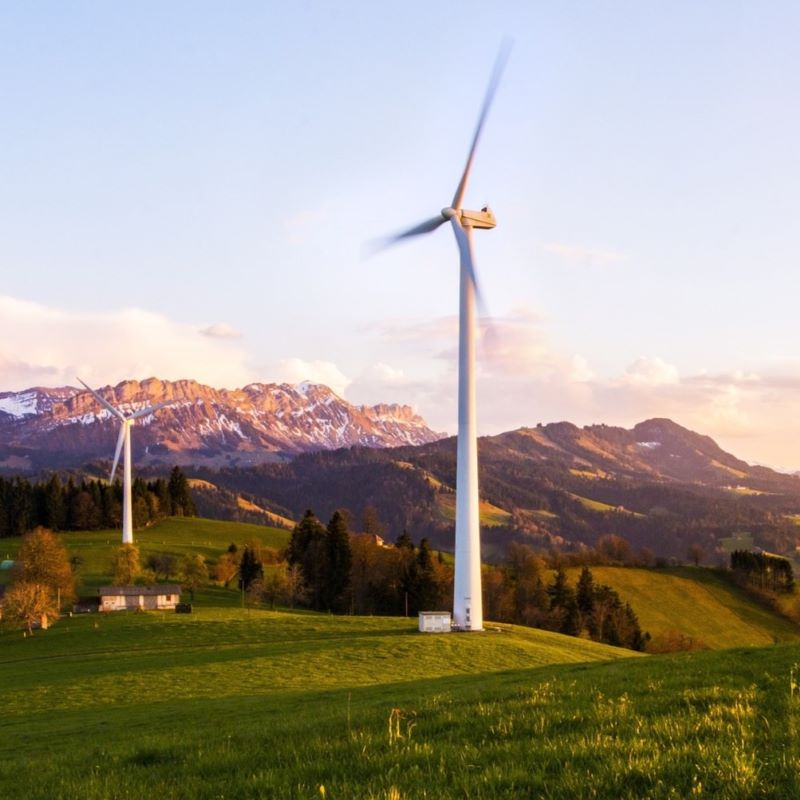

# Green Light Geospatial
### GIS and Geospatial Services
### *Geospatial for a Better World*
  
<h3 class="block1">Explore renewable energy and world heritage with open source interactive web maps</h3>

Search and discover interesting locations around the world with open data and mapping tools. 

<ul class="wp-block-list">
<li class="">Explore traditional and renewable power facilities with the Global Energy and Renewables Map. </li>
<li class="">Explore and tour world heritage sites with the UNESCO World Heritage Tribute Map.</li>
</ul>
[*See the Maps*](/maps.md)

