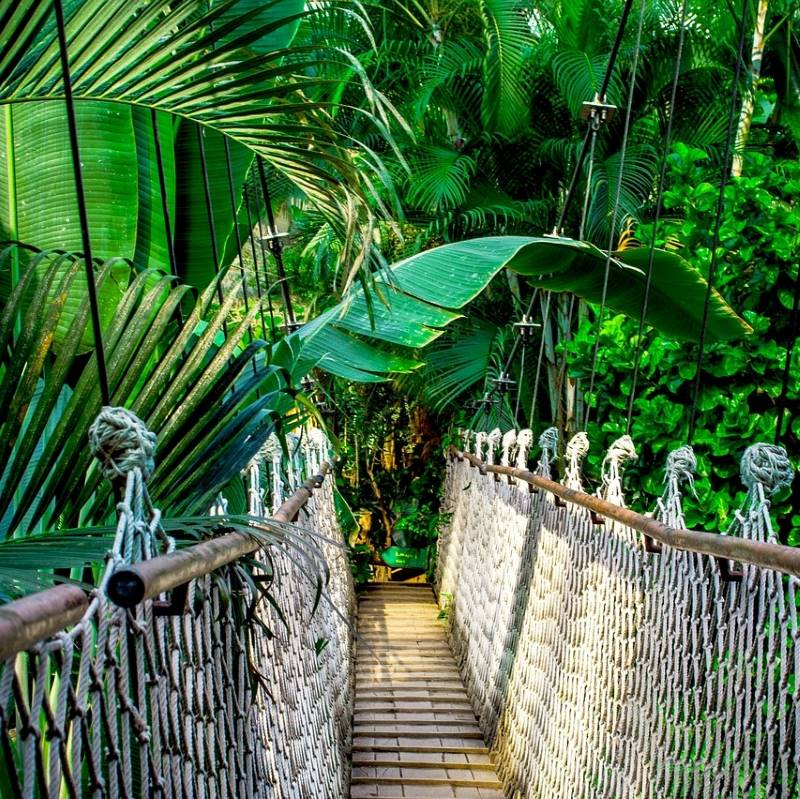

# *Geospatial for a Better World*
  
## Maps
### *Explore renewable energy and world heritage with open source interactive web maps*
Search and discover interesting locations around the world with open data and mapping tools.
* Explore traditional and renewable power facilities with the *Global Energy and Renewables Map*.
* Explore and tour world heritage sites with the *UNESCO World Heritage Tribute Map*.
  
[***See the Maps***](/maps.md)

## Services

|   |  |  |
|----------|----------|----------|
| **Applications** | **Geo Data** | **Projects** |
|*Services for the geospatial application development lifecycle:*  |*Services to design and build spatial databases and processes:*  |*Services to plan and implement your geospatial project work:*  |
|- Requirements Analysis  |- Geodatabase Design and Data Modeling  |- Mapping and Cartography  |
|- Application Design  |- Data Compilation and Data Management  |- Project Assessment  |
|- UI/UX and Workflows  |- Data Analysis and Processing  |- Project Management  |
|- Demonstrations and Prototyping  |- Field Data Collection  |- Mobile and Field GIS/GPS Projects  |
|- Product Management  |- Data Workflows  |- Staff Augmentation  |

## Experience
### *Navigating geospatial project challenges*
- Every project has its own unique challenges. Taking the time to evaluate your requirements and options, we can determine the right level of support, at the right time, to help you reach your project objectives.
- With over 25 years of experience helping organizations navigate geospatial projects, together we can chart a course based on your needs and requirements.

## Contact
### *Ready to assist with your geospatial project needs*
* Support services for applications, data and projects.
* Staff augmentation to assist you and your team with specific project tasks.
Let’s discuss your project and requirements.

