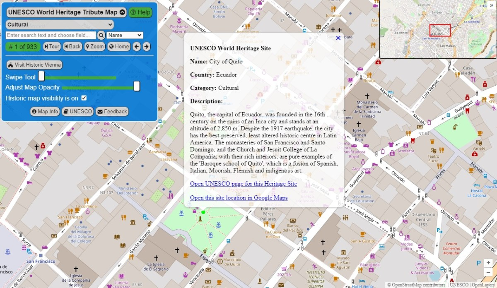
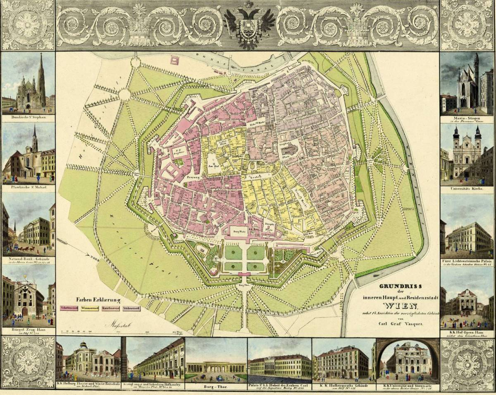

# UNESCO World Heritage Tribute Map

The UNESCO World Heritage Tribute Map is an interactive web map launched in October 2023 as a tribute to UNESCO’s preservation and conservation work. The web map allows visitors to search, discover and explore the many cultural and natural UNESCO world heritage sites and their locations.

## Why create a map tribute to the UNESCO World Heritage List?
The purpose of the web map is educational, to help promote awareness and understanding of the UNESCO world heritage sites and the important work of UNESCO. It is intended to allow visitors an interesting geographic way to discover and learn about the heritage sites with information from UNESCO and explore the geography around the sites.

Today, more than ever, conservation work is crucial for the overall safety of our world. As UNESCO has pointed out, safeguarding heritage is critical as it brings countries and communities together, uniting people around a common belief in the value of our history and environment. In the next section you can learn more about UNESCO and why this preservation work is so important, with links to UNESCO site information.

The web map provides a search feature which allows users to search on site name, country and description field information. When the search returns selected sites, the user can click through the sites which displays an informational popup on the map with UNESCO information on the site, as well as a link to UNESCO’s dedicated page for the site. The popup also includes a link to the site location in Google Maps so the user can explore the location with satellite imagery and other features.

The [UNESCO World Heritage Tribute Map](https://greenlightgeo.github.io/ol-maps/maps/unesco_heritage/) was built using the OpenLayers map library, and uses UNESCO’s world heritage sites open data and OpenStreetMap as its basemap foundation.  Click the link above or the map image below to open the map.

*The Tribute Map displaying the City of Quito heritage site. Click the image to open the Tribute map.*

## What is UNESCO and why is world heritage preservation important?
As described by UNESCO: 
“UNESCO, the United Nations Educational, Scientific and Cultural Organization, seeks to encourage the identification, protection, and preservation of cultural and natural heritage around the world considered to be of outstanding value to humanity. This is embodied in an international treaty called the Convention concerning the Protection of the World Cultural and Natural Heritage, adopted by UNESCO in 1972.”

“What makes the concept of World Heritage exceptional is its universal application. World Heritage sites belong to all the peoples of the world, irrespective of the territory on which they are located.”

“UNESCO works to safeguard heritage so that future generations can enjoy, benefit and learn from the legacy of the past. In addition to its intrinsic value, heritage can be a driver of sustainable development and local job creation. Conserving the world’s natural heritage is also essential for the health of the planet and plays a key role in addressing the risk of natural and human-made disasters. Finally, safeguarding heritage brings countries and communities together, uniting people of different backgrounds around a common belief in the value of our history and environment. This is particularly crucial in times of emergency, when the safeguarding, continuation or rehabilitation of heritage provides an invaluable source of stability and hope for affected communities. Given the immense value of heritage for present and future generations, countering the growing threats it faces has never been more important.”

<iframe width="900" height="484" src="https://www.youtube.com/embed/dyrfNSJa7sw?si=0UxPpE_xWeQqzmDi" title="YouTube video player" frameborder="0" allow="accelerometer; autoplay; clipboard-write; encrypted-media; gyroscope; picture-in-picture; web-share" referrerpolicy="strict-origin-when-cross-origin" allowfullscreen></iframe>

*UNESCO video on the Natural World Heritage sites.*

**References and further reading:**
* [About UNESCO](https://whc.unesco.org/en/about/)
* [Why does UNESCO safeguard heritage?](https://en.unesco.org/sites/default/files/info_sheet_heritage.pdf)
* [World Heritage](https://www.unesco.org/en/world-heritage)
*  [World Heritage in Danger](https://whc.unesco.org/en/158/)
*  [Preserving cultural heritage to build a better world](https://www.unesco.org/en/cultural-heritage-7-successes-unescos-preservation-work)

## Why Vienna for the historic map overlay?
The World Heritage Committee inscribed the Historic Centre of Vienna on the [list of World Heritage in Danger](https://whc.unesco.org/en/news/1684) due to high-rise projects in the middle of the Austrian capital. Users of the Tribute map can see how a historic map overlay can provide a quick understanding of the scale of modern changes impacting a cultural site, in this case using a historic map of Vienna’s city center that is now almost 200 years old. The Tribute map’s swipe and opacity tools allow the user to quickly compare views of the historic city layout and the current layout. It provides an interesting glimpse into the past and changes made over the past two centuries.

As described by UNESCO, “Vienna developed from early Celtic and Roman settlements into a Medieval and Baroque city to become the capital of the Austro-Hungarian Empire. It played an essential role as a leading European music center, from the great age of Viennese Classicism through the early part of the 20th century. The historic center of Vienna is rich in architectural ensembles, including Baroque castles and gardens, as well as the late-19th century Ringstrasse. The site was inscribed on the World Heritage List in 2001.”

Below is the full 1830 map from Carl Graf Vasquez which was used in the Tribute map overlay. Other images of Vasquez’s 1830 map series can be [found here.](https://commons.wikimedia.org/wiki/Category:1830_Vienna_map_series_by_Carl_Graf_Vasquez)

*Historic map of Vienna by Carl Graf Vasquez.*

#### Special thanks to the following organizations for making the Tribute Map possible:
* Thanks to **UNESCO** for sharing open data on its globally important World Heritage Sites.
*  Thanks to **OpenStreetMap** and its contributors for sharing their important work and open basemap.
* Thanks to **OpenLayers** and its contributors for an excellent free and open source map library on which this map was built.

